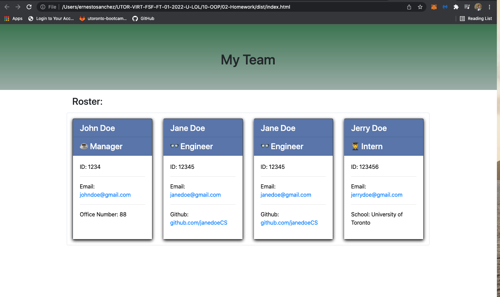

# Ernesto Team Profile Generator

[](https://opensource.org/licences/MIT)

## Description

This application will create a team roster HTML. Composed of a manger, engineers and interns. This application uses Command-Line-Interface to get the desired employees and will create a nice roster HTML rendering.

## Table of Contents

-   [User Story](#userstory)
-   [Demo Video](#demovideo)
-   [Screen Shots](#screenshots)
-   [Installation](#installation)
-   [Usage](#usage)
-   [License](#license)
-   [Contributing](#contributing)
-   [Tests](#tests)
-   [Questions](#questions)

## User Story

AS A manager, I WANT to generate a webpage that displays my team's basic info, SO THAT I have quick access to their emails and GitHub profiles

## Demo Video

![Demo Good ReadMe Generator]
<video src='![Demo Good ReadMe Generator]' width=180/>

## Screenshots




## Installation

This project uses 2 npm packages:

-   [axios](https://www.npmjs.com/package/axios)
-   [inquirer](https://www.npmjs.com/package/inquirer)
    To install necessary dependencies, run the following command:

```
npm i inquirer
```

```
npm install -y
```

## Usage

To run tests, run the following command:

```
node index.js
```

## License

    License is MIT standard license.

## Contributing

It is an open project and everyone can contribute - please send and email requesting to be added as a contributor

## Tests

npm test

## Questions

If you have any questions about the repo, open an issue or contact [ernestosanchezCS](https://github.com/ernestosanchezCS/) directly at ernestosanchez8888@gmail.com.
